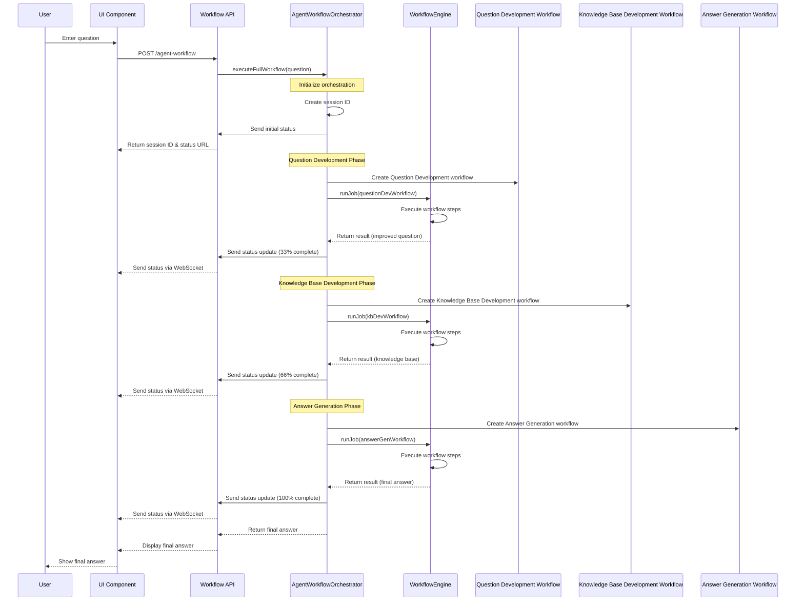
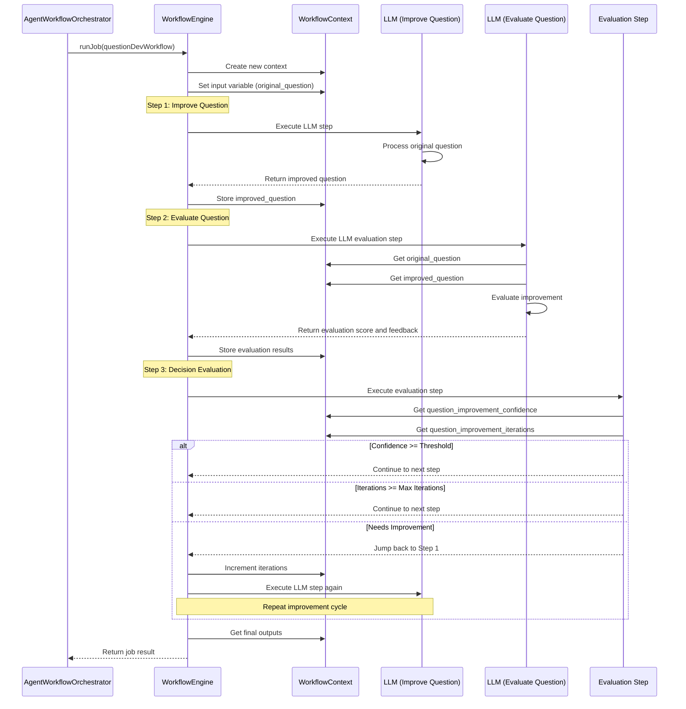
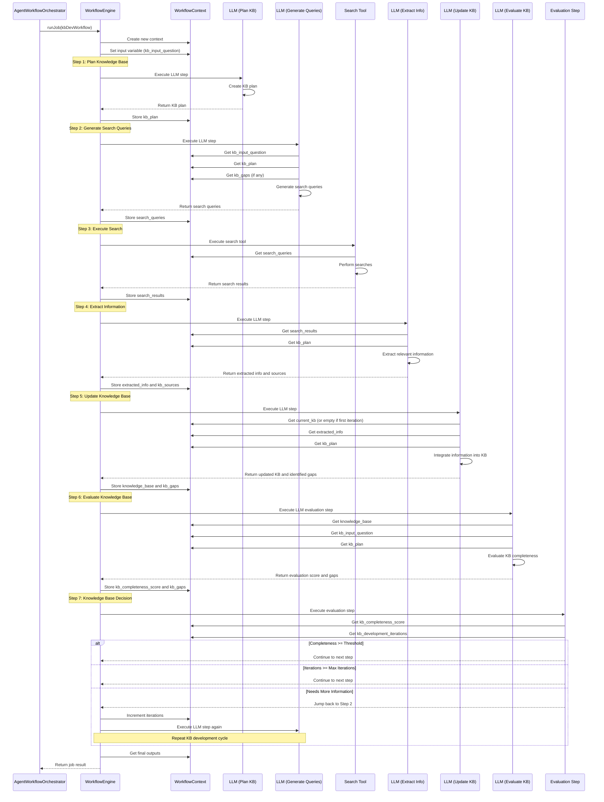
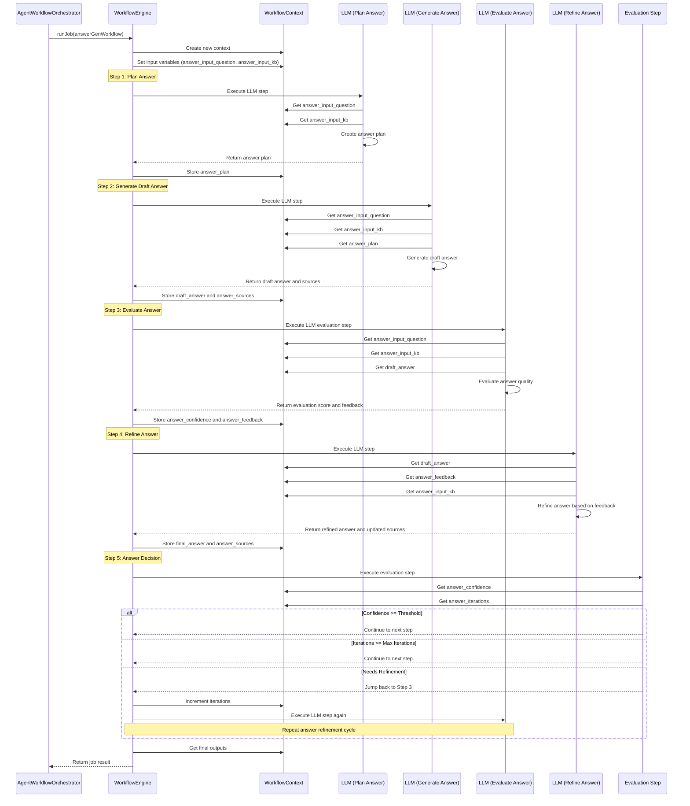
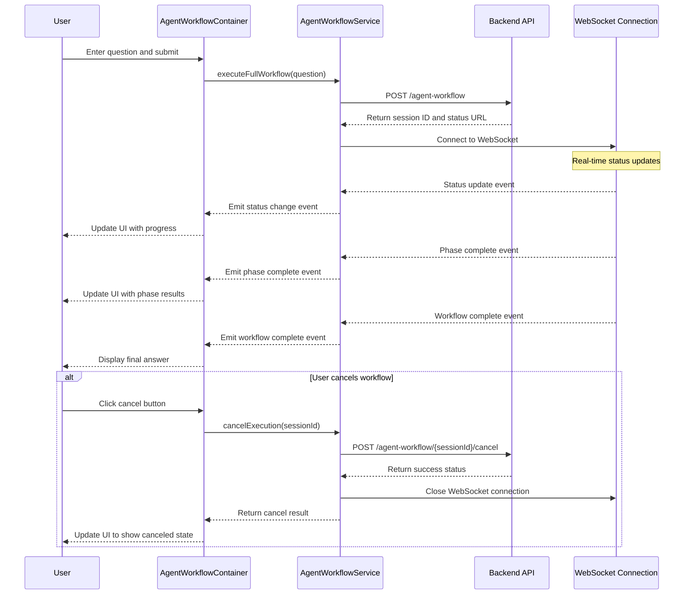
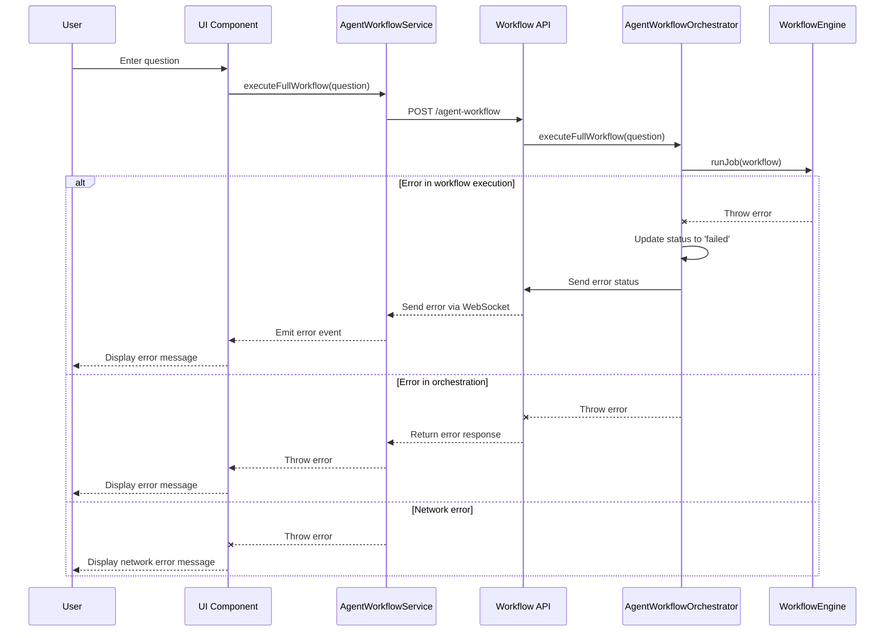

# Agent Workflow Sequence Diagrams

This document contains sequence diagrams illustrating the interactions between components in the agent workflow system.

## 1. Overall Workflow Execution Sequence

## 2. Question Development Workflow Execution

## 3. Knowledge Base Development Workflow Execution

## 4. Answer Generation Workflow Execution

## 5. Frontend Component Interaction

## 6. Error Handling Sequence

These sequence diagrams illustrate the detailed interactions between components in the agent workflow system, showing how data flows through the system and how the different phases of the workflow are executed. 